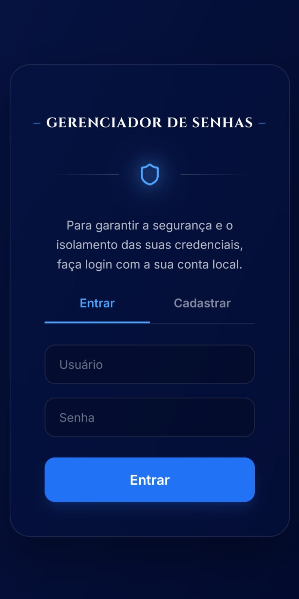
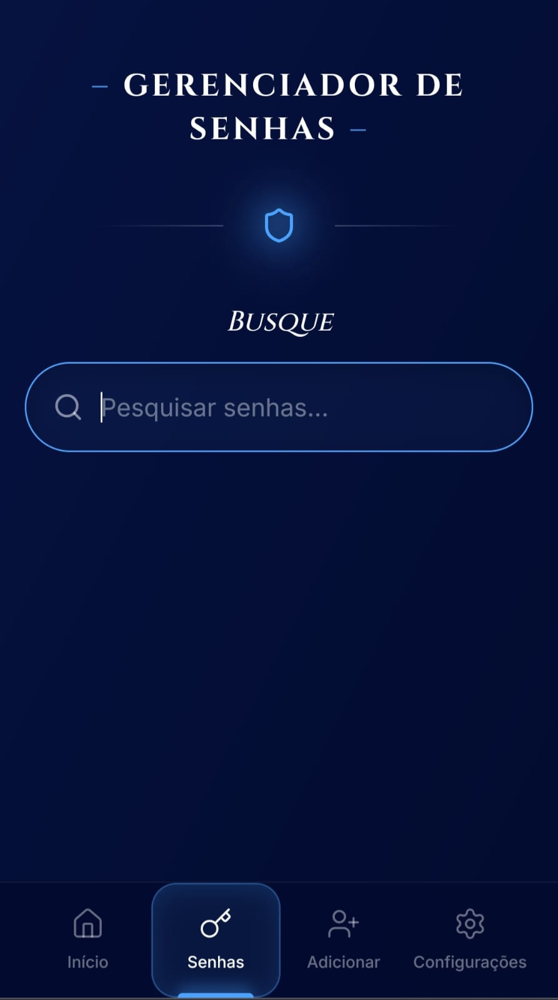

# 🛡️ Secure Password Manager

> Um gerenciador de senhas seguro desenvolvido com React, TypeScript e Firebase, utilizando criptografia AES no lado do cliente para proteger credenciais antes do armazenamento.

> ## 🌐 Demonstração

| Ambiente | Link |
|----------|------|
| Produção | https://gerenciador-senhas-v2.web.app/ |


---
## 📸 Screenshots

### Tela de Login



---

### Pesquisa



---

### Resultado da Pesquisa


---

### Nova Credencial


---

### Painel Administrativo


# 📖 Sobre o Projeto

O **Vault Manager** é uma aplicação web desenvolvida para armazenar credenciais de forma segura, moderna e intuitiva.

O sistema utiliza **criptografia AES (CryptoJS)** diretamente no navegador, garantindo que as senhas sejam criptografadas antes de serem enviadas ao banco de dados.

Além do gerenciamento de credenciais, o projeto possui um sistema de autenticação completo e controle de permissões baseado em papéis (**RBAC**), permitindo que administradores criem e gerenciem novos usuários.

---

# ✨ Funcionalidades

- 🔐 Autenticação com Firebase Authentication
- 🔑 Criptografia AES Client-Side
- 📂 Cadastro de credenciais
- ✏️ Edição de credenciais
- 👁️ Visualização segura de senhas
- 🗑️ Exclusão de credenciais
- 🔎 Pesquisa em tempo real
- 👥 Controle de acesso (RBAC)
- ⚡ Sincronização em tempo real utilizando Firestore
- 🌙 Interface moderna em Dark Mode
- 📱 Layout responsivo (Mobile First)

---

# 🏗️ Arquitetura

```
React + TypeScript
        │
        ▼
 Interface (TailwindCSS)
        │
        ▼
 Firebase Authentication
        │
        ▼
 CryptoJS (AES Encryption)
        │
        ▼
 Cloud Firestore
```

---

# 🛠️ Tecnologias

### Front-end

- React
- TypeScript
- Vite
- Tailwind CSS

### Backend (BaaS)

- Firebase Authentication
- Cloud Firestore

### Segurança

- CryptoJS (AES Encryption)

### UI

- Lucide React
- Google Fonts

---

# 🔒 Segurança

Uma das principais preocupações do projeto foi garantir que nenhuma senha fosse armazenada em texto puro.

Fluxo de funcionamento:

```
Usuário digita a senha
        │
        ▼
Criptografia AES (CryptoJS)
        │
        ▼
Senha criptografada
        │
        ▼
Firestore
```

A descriptografia ocorre apenas no navegador do usuário autenticado quando a senha precisa ser visualizada.

---

# 👥 Controle de Permissões (RBAC)

O projeto implementa dois níveis de acesso:

### Usuário

- Visualizar credenciais autorizadas
- Pesquisar credenciais
- Visualizar senhas

### Administrador

- Todas as permissões do usuário
- Criar novos usuários
- Gerenciar credenciais
- Gerenciar permissões

Para evitar que o administrador seja desconectado ao criar novas contas, foi utilizada uma **instância secundária do Firebase Authentication**, permitindo registrar usuários sem alterar a sessão atual.

---

# ⚡ Recursos

- Real-time Database com `onSnapshot`
- Interface Glassmorphism
- Responsividade Mobile First
- Componentização com React
- Tipagem completa com TypeScript
- Código modular e reutilizável

---

# 📂 Estrutura do Projeto

```
src/
│
├── components/
│   ├── AuthScreen
│   ├── CredentialList
│   ├── EditCredentialModal
│   ├── AdminPanel
│   └── SettingsPanel
│
├── services/
│
├── hooks/
│
├── types/
│
├── utils/
│
└── firebase/
```

---

# 🚀 Como Executar

## Clone o projeto

```bash
git clone https://github.com/marinsonline-dev/gerenciador-de-senhas.git
```

## Entre na pasta

```bash
cd gerenciador-de-senhas
```

## Instale as dependências

```bash
npm install
```

## Configure as variáveis de ambiente

Crie um arquivo:

```env
.env
```

Copie o conteúdo do arquivo:

```env
.env.example
```

Configure suas credenciais do Firebase.

---

## Execute o projeto

```bash
npm run dev
```

---

# 📸 Funcionalidades Principais

✔ Login seguro

✔ Cadastro de usuários

✔ Criptografia AES

✔ Gerenciamento de senhas

✔ Busca em tempo real

✔ Painel Administrativo

✔ Controle de permissões

✔ Interface responsiva

---

# 🎯 Objetivos do Projeto

Este projeto foi desenvolvido com foco em demonstrar conhecimentos em:

- React
- TypeScript
- Firebase
- Firestore
- Firebase Authentication
- Criptografia
- Segurança de aplicações Web
- Controle de acesso (RBAC)
- Componentização
- Arquitetura Front-end
- UX/UI
- Responsividade

---

# 📄 Licença

Este projeto está disponível para fins de estudo e demonstração de portfólio.

---

## 👨‍💻 Desenvolvedor

**Marcelo Marins**

- GitHub: https://github.com/marinsonline-dev
- LinkedIn: https://www.linkedin.com/in/marcelo-marins-94925a369
